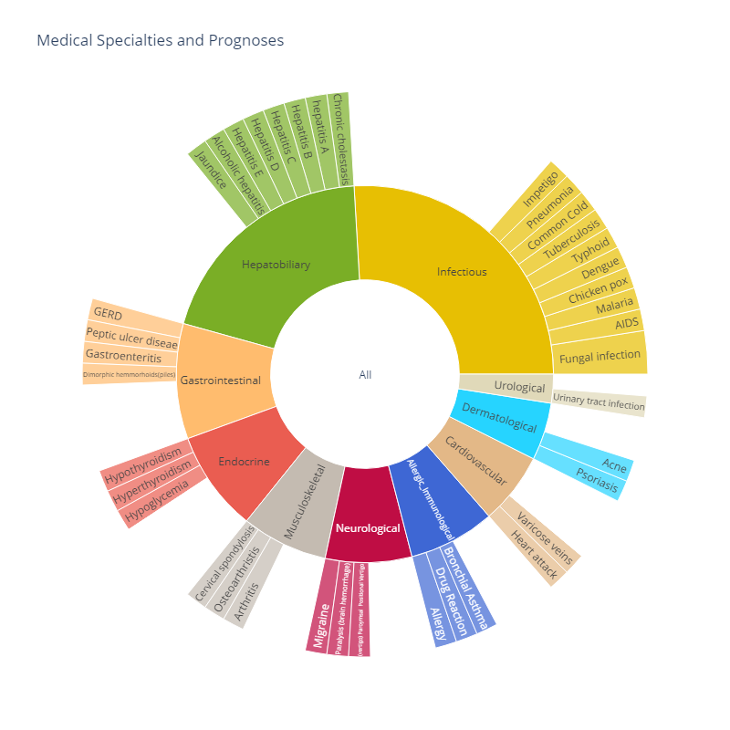

# Team 3 Project - Disease Prediction Using Machine Learning
Data Science Institute - Cohort 4 - Team 3 Project 

## Members
- (Amir) Hossein Baghdadi 
- Joao Tiago Foa Binsztajn (Tiago Foa)
- Lisa Feeney
- Marcio Sugar
- Serhii Bohoslavets

## Dataset
- [Disease Prediction Using Machine Learning](https://www.kaggle.com/datasets/kaushil268/disease-prediction-using-machine-learning/data)

## Research Question
- Which symptom features are the most significant predictors of a disease? 

## Business Case
- What is the question our analysis is trying to answer?
TODO:

- Who is the intended audience for our data analysis?
TODO:

## Project Track
- [Backlog - UofT-DSI | Team Project | Cohort 4 - Team 3](https://github.com/users/msugar/projects/2) has the tasks assigned to each team member, and their completion status.

## Reference
- [Canadian Chronic Disease Surveillance System (CCDSS)](https://health-infobase.canada.ca/ccdss/data-tool/)
